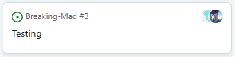
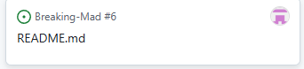

# Breaking-Mad

## Deployment:https://alexaspinalldev.github.io/Breaking-Mad/

## Am I Responsive Image:

## Introduction:
A generator of inspirational images from the twisted mind of Vince Gilligan. We sort to end stress and other negative feelings through our innovative combination of calming inspirational backdrops, and the art of writing found in the Breaking Bad scripts.

## Key objectives:
- Create an array of images that can be sorted through and displayed randomly to the user
- Create a series of legible quotes from the script of Breaking Bad that reminds the user of the importance of art
- Create a functional website that is accessible and simple to use

## User Stories

- We wanted to make sure our users could be greeted with a randomised new source of inspiration from the show in the form of a quote

- We wanted our users to have access to an array of inspirational, and calming images to offer them relief from stress

- Our website had to pass all necessary tests

- We knew our website had to be accessible, responsive and legible for all users, including easily recognisable buttons to start the calming process

- For our website to be accessible to customer's it had to be deployed so they could access it.

- This was less for the users but we knew our course facilitators would want to see a lovely ReadME

## WireFrame:

- We liked the interactivity of a front and center button taking us to our main quotation generator
- We wanted our quote generator to be clear and concise on the page, with nothing to distract from it's calming powers

## AI Image Generation

- We used ChatGPT's image generator DALLE, and AI Image Generator to generate our calming images, which through the power of AI computation enables them to be more calming and inspirational.
- Image optimser Squoosh was used where the images weren't optimal
 
- Keywords like 'vivid' 'bright' 'warm' 'serene' were used for the prompts

### Below are some of our images used with examples of prompts:

- "A serene redwood forest scene with towering, ancient redwood trees reaching towards the sky. The forest floor is lush with green ferns and soft moss"
  

-

-

-

- "A vivid underwater scene showcasing a vibrant coral reef teeming with life. The reef features a variety of colorful corals in shades of orange, pink"
  

- "A breathtaking scene of a lush waterfall cascading down a cliff surrounded by a dense tropical rainforest. The waterfall is framed by vibrant green forest"

## Website Features and Functions

- This website includes two webpages;
one home-page
one quote generator page

- This website includes several interactive buttons
- This website incldues an array of quotes and images, which can all be viewed at random
- This website incldues the power to calm oneself during stressful moments

## Features and Functions

### Javascript

There are three main functions to the site's interactivity. The main quote-retrieving function includes the other functions as children.

The first function accesses the chosen API, retrieving a random quote from Breaking Bad. The payload is parsed into JSON then formatted into an element on the page. This can be independently triggered for the user to choose their own background if they are satisfied with the quote.

The second function cycles through an array of AI-generated background images.

The third function uses a random generator and a pair of switch statements to assemble an array of classes to position the text over the image. The arrays are applied and removed with for...let loops. 

### Technologies used
- HTML5
- CSS3
- JavaScript
- Bootstrap 5.3
- DALLE via ChatGPT

The API was accessed from this site: https://breakingbadquotes.xyz/

#### AI Used:

DALLE-2: https://openai.com/index/dall-e-2/
ChatGPT: https://chatgpt.com/
Squoosh: https://squoosh.app/
AI Image Generator: https://deepai.org/machine-learning-model/text2img

- Testing:

Credits:
- Web Designer Somerset Dromgoole: https://github.com/Samersetred

- Web Designer Ben Williams: https://github.com/BenWilliams89

- Web Designer Alex Aspinall: https://github.com/alexaspinalldev
